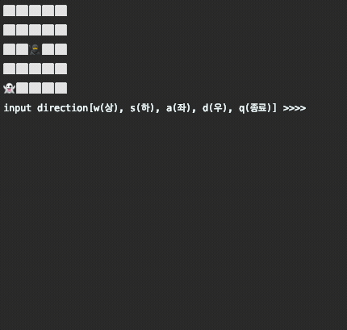
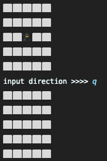
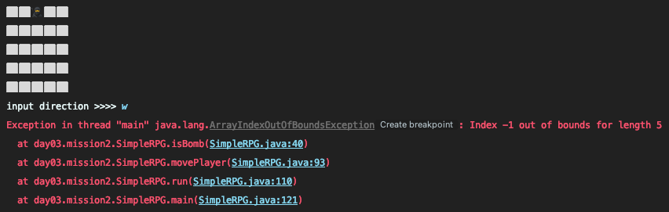

# 🎮 ~~(no)~~ simple rpg 🎮

## 게임 설명

- 콘솔 입력으로 WASD 중 하나의 키를 입력 후 엔터를 누르면 캐릭터가 상좌하우로 이동
- 캐릭터🥷가 몬스터👻의 위치까지 이동하면 몬스터👻가 사라지고 점수 획득
- 점수 획득시 새로운 몬스터 배치
- 캐릭터🥷가 숨겨진 지뢰💣를 밟으면 사망

---

## 추가할 기능들

- [ ] 난이도를 점점 어렵게
  - [ ] 점수 획득시 새로운 지뢰를 배치
  - [ ] 스테이지를 클리어하면 다음 스테이지엔 더 넓은 필드로
- [ ] 추가하고 싶은 컨텐츠
  - [ ] 유닛에 공격력과 체력 부여하여 지뢰를 밟지 않아도 체력이 0이 되면 사망하도록
  - [ ] 여러가지 아이템
    - [ ] 무기
    - [ ] 포션(체력, 투명화 .. 등등)
- [ ] GUI로 구현해보기

---

그동안 했던 여러 미션 중에 1주차의 ~~(초복잡)~~초간단 RPG 미션을 가장 재밌게 느꼈다.

사실 기본적인 예외처리조차 하나도 안해두어서

- 몬스터와 지뢰를 다 숨겨둔 탓에 완전한 랜덤 암흑 게임인데다가
- wasd 외의 다른 입력을 하면 `player`가 사라지기도 하고,  
  
- 범위를 벗어나면 프로그램이 종료가 되어버리기도 하는 등  
  

미완성 상태였는데, 매주마다 몰아치는 미션에 제대로 완성을 못한게 계속 아쉬웠다.  
그래서 과정이 끝나고 나면 완성해볼 생각이였는데, 마지막주에 개인 프로젝트를 할 시간이 주어져서
이번 기회에 제대로 완성도 해보고 이것저것 기능을 추가해보려고한다.

3주가 지나서 기존에 구현해두었던 코드를 다시 열어보니 완전 개판이라서 아예 처음부터 새로 시작하는게 나을 것 같단 생각이 들었는데, 코코아를 과정을 시작하던 처음과 지금 얼마나 성장했을지 비교해볼 수 있는 좋은 기회인 것 같아 그대로 불러와서 리팩토링을 하기로 결심했다.~~(그런 짓은 하지 말았어야 했는데...)~~

결국 리팩토링만 하다가 시간이 다 가버렸고~ 원래의 요구사항만 겨우 구현했다ㅎㅎ 그런 과정에서 느낀점은 다음과 같다.

- **done is better than perfect**
  - 수업시간에 자주 듣던 말인데 그냥 그렇구나~ 하고 생각만 하고 실천하지 못한 것 같다.
  - 너무 욕심부리지 말고 지금 당장 할 수 있는 만큼 하자.
- **확장가능성을 염두에 둔 설계의 중요성**
  - 중간에 뭔가 잘못됨을 느끼고도 리팩토링을 계속 할 수 밖에 없었던 이유는 추가하고 싶다 생각한 여러 기능들이 기존의 구조를 유지한채 구현한다면 나중에 구조개선이 더 힘들어질 것 같다는 생각이 들어서였다.
  - 앞으로 어떤 기능이 추가될지 모르기에 유연하게 대처할 수 있도록 설계를 탄탄히 해두는 것이 정말 중요하고 어렵다.
- ~~1주차의 나 정말...ㅎ~~
  - 그래도 맘에 안들고 뜯어 고치고 부분이 많이 보였다는거는 그만큼 성장했다는거겠지?
  - 한달간 알게모르게 조금은 성장한것같다ㅎㅎ

이렇게 코코아 과정은 결국 끝이 났지만 심심할 때마다 생각해둔 기능 하나씩 구현하면서 혼자서도 잘 완성해보자ㅎㅎㅎ!
